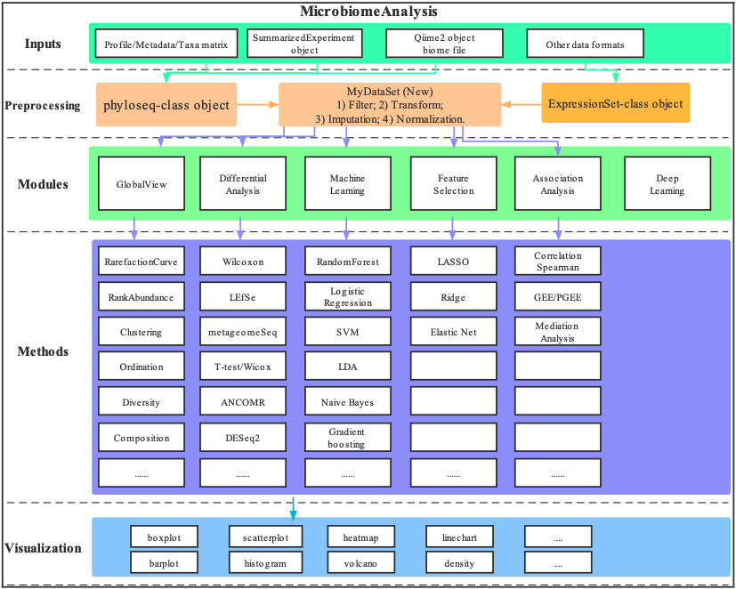

<!-- README.md is generated from README.Rmd. Please edit that file -->

# MicrobiomeAnalysis: A comprehensive R package for managing and analyzing microbiome data 

```{r, echo=FALSE, results="hide", message=FALSE}
Biocpkg <- function (pkg) {
    sprintf("[%s](http://bioconductor.org/packages/%s)", pkg, pkg)
}
library(conflicted)
conflicted::conflict_prefer("filter", "dplyr")
knitr::opts_chunk$set(fig.path = "inst/figures/README-")
```

This package has many unique features:

## The Overview of **MicrobiomeAnalysis**

```{r, echo=FALSE, fig.width=12, dpi=600, fig.align="center", fig.cap="The Overview of MicrobiomeAnalysis"}

```

## :writing_hand: Authors

[Hua Zou](mailto:zouhua1@outlook.com)


## :arrow_double_down: Installation


### Installation of dependencies

Requiring the R-base version more than **4.1.2**. Some of the dependencies from CRAN or bioconductor, but others, are only obtained from github. the version of dependencies are as follows:

* phyloseq (>= 1.38.0)
* ggplot2 (>= 3.3.5)
* dplyr (>= 1.0.8)
* tibble (>= 3.1.6)
* ggplot2 (>= 3.3.5)
* Biobase (>= 2.54.0)

There are two methods to install the aforementioned packages.

#### dependencies in CRAN & Bioconductor
```R
install.packages("pacman")

library(pacman)

pacman::p_load(phyloseq, dplyr, tibble, Biobase, ggplot2)
```

#### dependencies in github
```R
# Step 1: Install devtools
if (!requireNamespace(c("remotes", "devtools"), quietly=TRUE)) {
  install.packages(c("devtools", "remotes"))
}
library(devtools)
#library(remotes)

# Step 2: install corncob package
devtools::install_github("bryandmartin/corncob")
# remotes::install_github("bryandmartin/corncob")
```

#### dependencies from website

Manual download of RAIDA_1.0.tar.gz from [here](http://cals.arizona.edu/~anling/software/RAIDA_1.0.tar.gz) and install locally 
```shell
R CMD INSTALL RAIDA_*.tar.gz

```
```R
install.packages("RAIDA_1.0.tar.gz", repos = NULL, type = "source")
```

Manual download of mbzinb_0.2.tar.gz from [here](https://github.com/jchen1981/MicrobiomeDDA/blob/master/mbzinb_0.2.tar.gz) and install locally 
```shell
R CMD INSTALL mbzinb_*.tar.gz

```
```R
install.packages("mbzinb_0.2.tar.gz", repos = NULL, type = "source")
```

### Installing MicrobiomeAnalysis

Get the released **MicrobiomeAnalysis** packages from [here](https://github.com/HuaZou/MicrobiomeAnalysis/releases).

```r
install.packages("MicrobiomeAnalysis*.tar.gz", repos = NULL, type = "source")
```

the development version from github:

```r
remotes::install_github("HuaZou/MicrobiomeAnalysis")
```

# :book: Vignette

Using the following command and Choosing the `html` for more details.

```R
utils::browseVignettes(package="MicrobiomeAnalysis")
```

**[the tutorial of Microbiota Data Analysis by MicrobiomeAnalysis](https://zouhua.top/MicrobiomeAnalysis/) made by bookdown**.


## :sparkling_heart: Contributing

Welcome any contributions or comments, and you can file them [here](https://github.com/HuaZou/MicrobiomeAnalysis/issues).

## :trophy: Acknowledgement

Thanks all the developers of the methods integrated into **MicrobiomeAnalysis**.  The reference package is [microbiomeMarker](https://github.com/yiluheihei/microbiomeMarker).

## :eight_pointed_black_star: Citation 

Kindly cite by using `citation("MicrobiomeAnalysis")` if you think **MicrobiomeAnalysis** helps you. Alternative way is Zou H (2022). _MicrobiomeAnalysis: An R package for analysis and visualization in metagenomics_. R package version 1.0.1, <URL:https://github.com/HuaZou/MicrobiomeAnalysis/>.

