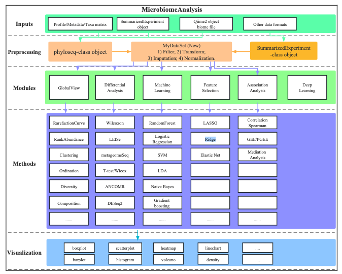

<!-- README.md is generated from README.Rmd. Please edit that file -->

# MicrobiomeAnalysis: A comprehensive R package for managing and analyzing microbiome data

This package has many unique features:

## The Overview of **MicrobiomeAnalysis**

<div class="figure" style="text-align: center">


<p class="caption">
The Overview of MicrobiomeAnalysis
</p>

</div>

## :writing_hand: Authors

[Hua Zou](mailto:zouhua1@outlook.com)

## :arrow_double_down: Installation

Requiring the R-base version more than **4.1.0**. Some of the
dependencies from CRAN or bioconductor, but others, are only obtained
from github. the version of dependencies are as follows:

### dependencies in CRAN & Bioconductor

``` r
install.packages("pacman")

library(pacman)

pacman::p_load(phyloseq, dplyr, tibble, Biobase, ggplot2)
```

### dependencies in github

``` r
# Step 1: Install devtools
if (!requireNamespace(c("remotes", "devtools"), quietly=TRUE)) {
  install.packages(c("devtools", "remotes"))
}
library(devtools)
#library(remotes)

# Step 2: install corncob package
devtools::install_github("bryandmartin/corncob")
# remotes::install_github("bryandmartin/corncob")
```

### Installing MicrobiomeAnalysis

Get the released **MicrobiomeAnalysis** packages from
[here](https://github.com/HuaZou/MicrobiomeAnalysis/releases).

``` r
install.packages("MicrobiomeAnalysis*.tar.gz", repos = NULL, type = "source")
```

the development version from github:

``` r
remotes::install_github("HuaZou/MicrobiomeAnalysis")
```

# :book: Vignette

Using the following command and Choosing the `html` for more details.

``` r
utils::browseVignettes(package="MicrobiomeAnalysis")
```

**[the tutorial of Microbiota Data Analysis by
MicrobiomeAnalysis](https://zouhua.top/MicrobiomeAnalysis_book/) made by
bookdown**.

## :sparkling_heart: Contributing

Welcome any contributions or comments, and you can file them
[here](https://github.com/HuaZou/MicrobiomeAnalysis/issues).

## :trophy: Acknowledgement

Thanks all the developers of the methods integrated into
**MicrobiomeAnalysis**. The reference package is
[microbiomeMarker](https://github.com/yiluheihei/microbiomeMarker). The
R codes of differential analysis methods are almost from
[microbiomeMarker](https://github.com/yiluheihei/microbiomeMarker).

## :eight_pointed_black_star: Citation

Kindly cite by using `citation("MicrobiomeAnalysis")` if you think
**MicrobiomeAnalysis** helps you. Alternative way is Zou H (2022).
*MicrobiomeAnalysis: An R package for analysis and visualization in
metagenomics*. R package version 1.0.3,
\<URL:<https://github.com/HuaZou/MicrobiomeAnalysis/>\>.
