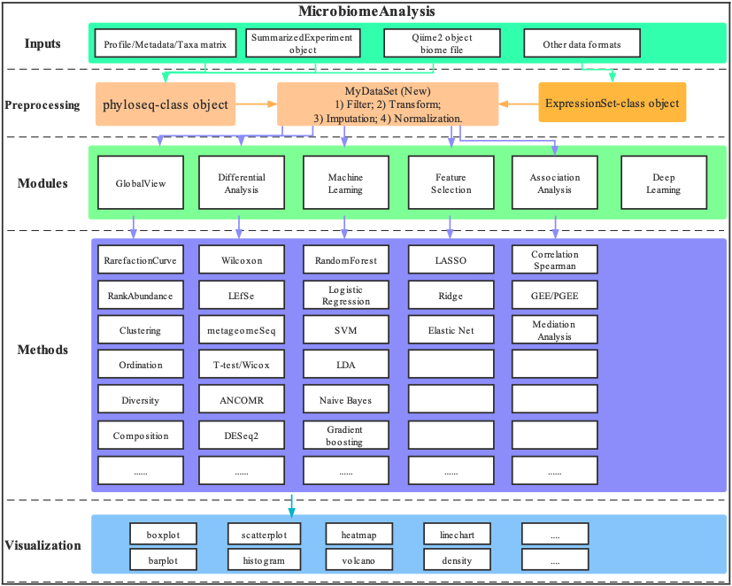

```{r, echo=FALSE, results="asis", message=FALSE, KnitrSetUp}
library(knitr)
knit_hooks$set(crop = hook_pdfcrop)
knitr::opts_chunk$set(crop=TRUE, tidy=FALSE, warning=FALSE, message=FALSE, fig.align="center")
Biocpkg <- function (pkg){
    sprintf("[%s](http://bioconductor.org/packages/%s)", pkg, pkg)
}
CRANpkg <- function(pkg){
    cran <- "https://CRAN.R-project.org/package" 
    fmt <- "[%s](%s=%s)"
    sprintf(fmt, pkg, cran, pkg) 
}
```

```{r, echo=FALSE, results="hide", message=FALSE, Loadpackages}
library(ggplot2)
library(phyloseq)
library(dplyr)
library(tibble)
library(MicrobiomeAnalysis)
library(conflicted)
conflict_prefer("filter", "dplyr")
conflict_prefer("select", "dplyr")
```

# Overview of **MicrobiomeAnalysis**
```{r, echo=FALSE, out.width="80%", out.width="80%", dpi=400, fig.align="center", fig.cap="The Overview of MicrobiomeAnalysis"}

```

# Convert inputs into phyloseq-class object

## inputs from dada2
```{r}
seq_tab <- readRDS(
  system.file("extdata", "dada2_seqtab.rds",
     package = "MicrobiomeAnalysis"))

tax_tab <- readRDS(
  system.file("extdata", "dada2_taxtab.rds",
    package = "MicrobiomeAnalysis"))

sam_tab <- read.table(
  system.file("extdata", "dada2_samdata.txt",
     package = "MicrobiomeAnalysis"), 
  sep = "\t", header = TRUE, row.names = 1)

ps <- import_dada2(seq_tab = seq_tab, tax_tab = tax_tab, sam_tab = sam_tab)

ps
```

## inputs from qiime2
```{r}
otuqza_file <- system.file(
     "extdata", "table.qza",
     package = "MicrobiomeAnalysis")

taxaqza_file <- system.file(
     "extdata", "taxonomy.qza",
     package = "MicrobiomeAnalysis")

sample_file <- system.file(
     "extdata", "sample-metadata.tsv",
     package = "MicrobiomeAnalysis")

 treeqza_file <- system.file(
     "extdata", "tree.qza",
     package = "MicrobiomeAnalysis")
 
 ps <- import_qiime2(
     otu_qza = otuqza_file, taxa_qza = taxaqza_file,
     sam_tab = sample_file, tree_qza = treeqza_file)
 ps
```


# Multivariate Community Analysis

Know more details of the aftermentioned statistical methods to see [@xia2018statistical].

## Multivariate homogeneity of groups dispersions (variances)

[@anderson2006multivariate]

```{r}
data("enterotypes_arumugam")
run_betadisper(enterotypes_arumugam, variable = "Enterotype", method = "bray")
```


## Permutational Multivariate Analysis of Variance (PERMANOVA)

[@anderson2014permutational]
```{r}
run_PERMANOVA(enterotypes_arumugam, method = "bray")
```

## Mantel Test (MANTEL)

[@mantel1967detection]
```{r}
run_MANTEL(enterotypes_arumugam,
           y_variables = c("Enterotype", "Clinical.Status"),
           z_variables = c("Nationality", "Gender"),
           norm = FALSE,
           method = "mantel.partial",
           method_dist = c("bray", "euclidean", "jaccard"))
```


## Analysis of Similarity (ANOSIM)

[@clarke1993non]
```{r}
run_ANOSIM(enterotypes_arumugam, variable = "Enterotype", method = "bray")
```

## Multi-response Permutation Procedures (MRPP)

[@mielke1991application]
```{r}
run_MRPP(enterotypes_arumugam, variable = "Enterotype", method = "bray")
```


# Session information {-}

This vignette was created under the following conditions:

```{r}
sessionInfo()
```

# References {-}
